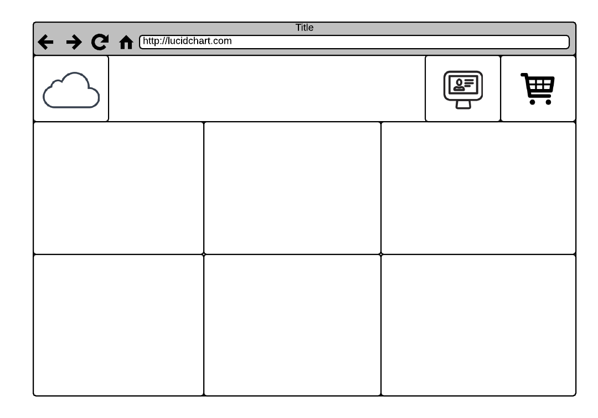
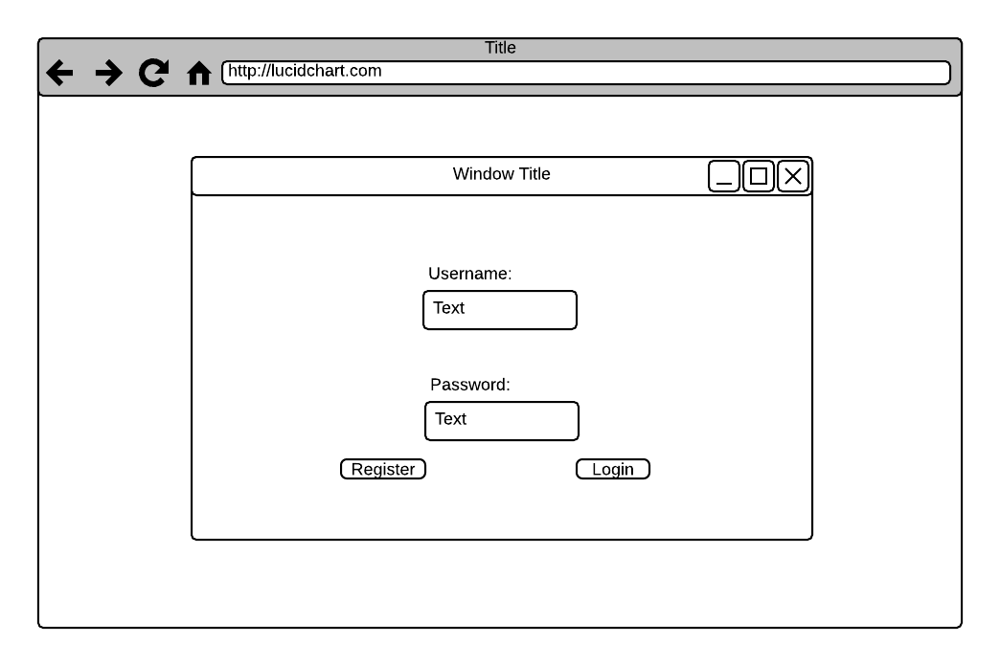
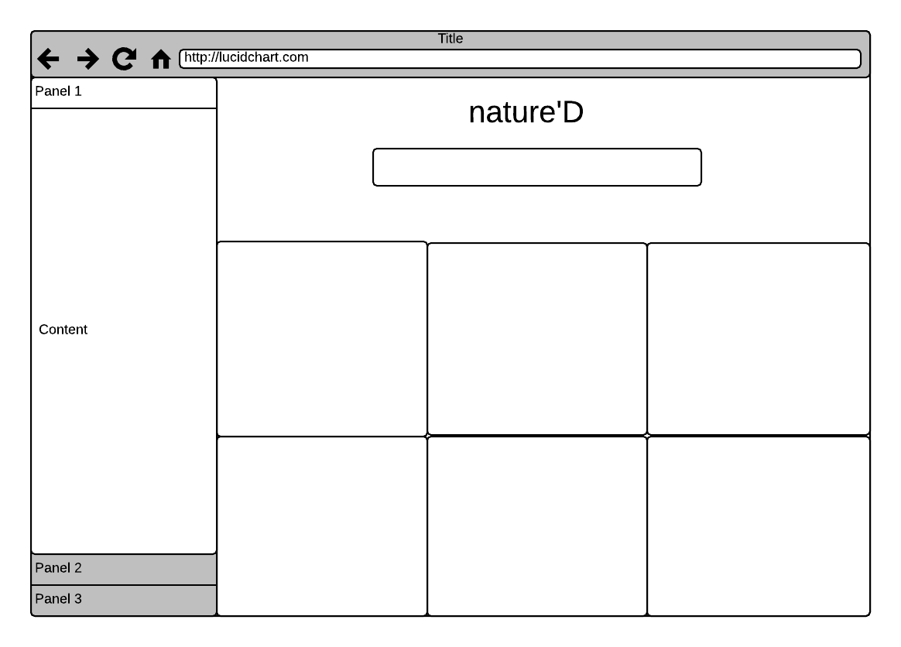
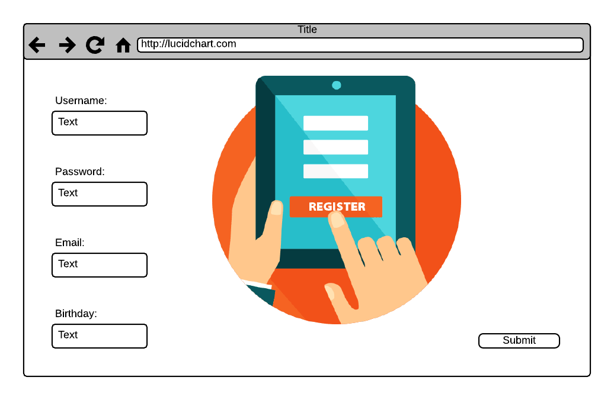
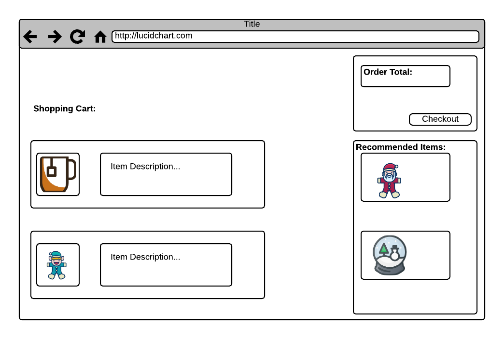
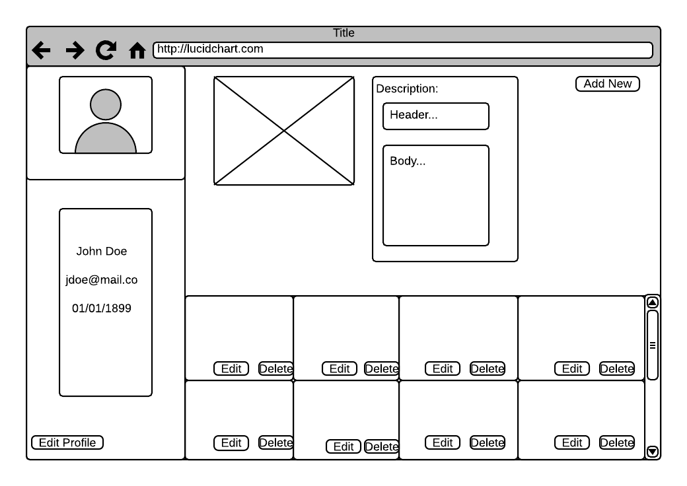

# nature`D

### Team Members

Berniris Coleman  
Ricardo Del Castillo  
Genaya James  
Timothy Keaveny  

## General Approach

Working as a group we initially separated each task we wanted to accomplish between the team members. In some cases we worked together with each team member being a driver for about an hour and the others navigating. With this approach we we're able to come together and create a functional application. 

Task that we were worked on individually before bringing the project were the landing page, the cart, and the profile. We worked together to come up with a design for our app, and decide which parts fit as components.

## Project Description

<!-- Use this section to describe your final project and perhaps any links to relevant sites that help convey the concept and/or functionality. -->

The purpose of this app is to be an e-commerce site for sports and outdoor activity. Users are able to buy their favorite gear to help them fullfill their goals for their fitness and hobbies.

- Site Example 1: https://www.amazon.com/
- Site Example 2: https://www.ebay.com/

## Wireframes

<!-- Include images of your wireframes.  -->









## Database Schema

### Table Name: users
| Column Name | Data Type |
| --- | :---: |
| id | primary key |
| username | text not null |
| email | text not null |
| password_digest | text not null |
| birthday |  |

### Table Name: products
| Column Name | Data Type |
| --- | :---: |
| id | primary key |
| user_id | references users(id) |
| name | text not null |
| description | text |
| price | integer not null |
| category_id | references categories(id) |
| image_url | text not null |
| amount | integer |
| state_id | references states(id) |

### Table Name: categories
| Column Name | Data Type |
| --- | :---: |
| id | primary key |
| category | ex) Hiking, Camping, Fishing, etc. |

### Table Name: payment_info 
| Column Name | Data Type |
| --- | :---: |
| id | primary key |
| card_no | integer not null |
| payment_type | ex) VISA, Mastercard, etc. |
| card_name | text not null |
| address_id | references shipping_address(id) |

### Table Name: shipping_address
| Column Name | Data Type |
| --- | :---: |
| id | primary key |
| address | text not null |
| zip_code | integer not null |
| state_id | references states(id) |

### Table Name: states
| Column Name | Data Type |
| --- | :---: |
| id | primary key |
| state | VARCHAR(2) |

### Table Name: cart
| Column Name | Data Type |
| --- | :---: |
| id | primary key |
| user_id | references users(id) |
| product_id | references product(id) |

## Priority Matrix

<!-- Include a full list of features that have been prioritized based on the `Time and Importance` Matrix.  -->

| Component | Priority | Estimated Time |
| --- | :---: |  :---: |
| Database Setup | 1 | 1hrs|
| Auth | 2 | 1hrs| 
| File Structure | 3 | 1hrs| 
| Page Layout | 4 | 6hrs| 
| Page Navigation | 5 | 4hrs| 
| Page Design | 6 | 9hrs|
| Total |  | 22hrs| 


## App Components

### Landing Page
<!-- What will a user see when they start your app? -->
A user will see a navbar at the top with our logo and the login/signup link ass well. Furthermore, below the navbar a grid with asthetic images will appear, each representing a different sport/category. In each grid square there will be a link with the name of each category. When clicked the link will redirect to a page listing products from that category. 

### App Initialization
<!-- What will a user see when the app is started?  -->
When the app is started the user will be able to see the the landing products and view specific categories and products. However, they won't be able to buy products unless they create an acount or log in to an existing account.

### Using The App
<!-- What will be the flow of the game, what will the user be expected to do and what will the user expect from the game. -->
Users will be able to view all products and filter products by categories, by clicking links in the landing page and filtering in the products page. An unregistered user will only be able to buy a product when signing up or logging in. The users can create new products, update existing ones, view their products and delete old ones. Similarly, users are able to view all products, filter by category, save and delete from their cart, and buy products. They do so by navigating through the links and pressing an add button in each product. When this is pressed the product is saved to their cart. After the user has saved all the products they desire they can press the cart icon to go to the buying page, where they enter their card to pay for the item. 


## MVP 

<!-- Include the full list of features that will be part of your MVP  -->

Users who are buyers are able to:

* Create an account
* View all products
* View by catgories
* Create a product
* Delete the product
* Update their product
* View all their products
* View a product
* Add to cart
* Delete from cart
* Buy products


## POST MVP

<!-- Include the full list of features that you are considering for POST MVP -->

* User:
    - Add ratings and comments.
    
* Us:
    - Add a pop up login page for login/ signup.


## Functional Components

Based on the initial logic defined in the previous game phases section try and breakdown the logic further into functional components, and by that we mean functions.  Does your logic indicate that code could be encapsulated for the purpose of reusablility.  Once a function has been defined it can then be incorporated into a class as a method. 

Time frames are also key in the development cycle.  You have limited time to code all phases of the game.  Your estimates can then be used to evalute game possibilities based on time needed and the actual time you have before game must be submitted. 

| Component | Priority | Estimated Time | Time Invested | Actual Time |
| --- | :---: |  :---: | :---: | :---: |
| Database Setup | 1 | 1hrs| 1hrs | 1hrs |
| Auth | 2 | 1hrs| 3hrs | 3hrs |
| File Structure | 3 | 1hrs| 1hrs | 1hrs |
| Page Layout | 4 | 8hrs| 9hrs | 9hrs |
| Page Navigation / Routes | 5 | 4hrs| 3hrs | 3hrs |
| Page Design | 6 | 9hrs| 10hrs | 10hrs |
| App Logic | 7 | 10hrs| 10hrs | 10hrs |
| Post-MVP | 8 | 7hrs| 1hrs | 1hrs |
| Total |  | 38hrs| 40hrs | 40hrs |

## Issues and Resolutions

* Making the category titles hoverable
* Making the register and the login forms pop up.
* Figuring out that 'a' links were causing a user to logout prematurely

## Technologies Used

* Mashape Random Quotes API

    - A collection of 60000+ Quotes with hundreds of different categories. Able to generate a random quote based on categories.

## Installation Instructions

How to install the app in your local machine.  
1. First you have to create a github account.  
2. Then go to the github account that holds this repo. Currently genkjames.  
3. After that click on the fork button on the top right corner. Then click on your account.  
4. Similarly, the next step is to clone the repo. This is done by clickig on the green button label 'clone or download'. Coppy the url.  
5. After that, write this in your terminal (Your terminal can be oppened by serching 'terminal' of finder and clicking on it) 'git clone "url that was coppied" ' hit enter.  
6. Open the aplication in your text editor for code. If you have sublime installed you can write 'subl natured' in your terminal. Sublime can be installed from their website https://www.sublimetext.com/.  
7. Go into natured by writing 'cd natured' your terminal.  
8. In your text editor run this command 'npm install'. The next step is to install your dependencies by writing into your terminal 'npm i'.  
9. The next step is to go into the clinet directory. Do this by writing 'cd client'. The next step is to write this in your terminal 'npm i'.  
10. After this you need to install your dependencies in react. Do this by writing 'cd client' followed by 'npm i'.  
11. We are ready to run the app. Write 'nom run dev' in your terminal.  


## Code Snippets

```

  function orderTotal(id) {
    return db.any(`
      SELECT SUM(products.price * cart.quantity)
      FROM products
      JOIN cart
      ON products.id = cart.product_id
      WHERE cart.user_id = $1
    `, id);
  }

  fetchOrderTotal() {
    fetch(`/api/cart/total/${this.state.user.id}`)
    .then(resp => {
      if (!resp.ok) throw new Error('There was an error');
      return resp.json();
    })
    .then(data => {
      let sum = data.contents[0].sum;
      if(sum === null) {
        sum = 0;
      }
      this.setState({
        total: sum
      })
    })
  }

  function updateProductAfterCheckout(product) {
    return db.one(`
      UPDATE products
      SET stock = $/stock/
      WHERE id = $/product_id/
      RETURNING *
    `, product);
  }

  updateProductAfterCheckout(product) {
    const options = {
      method: 'PUT',
      body: JSON.stringify(product),
      headers: {
        'content-type': 'application/json'
      }
    }
    const userId = this.state.user.id;
    const productId = product.product_id;
    fetch(`/api/cart/${userId}/update/${productId}`, options)
    .then(resp => {
      if (!resp.ok) throw new Error('There was an error');
      return resp.json();
    })
    .then(() => {
      this.deleteFromCart(product.id);
      this.fetchProducts();
      this.fetchRecommended();
    })
  }

``` 

With this code users are able to view how much money the items in the cart add up to. Also once a user hits the checkout button the stock of those products in the cart goes down depending on the quantity of each product.
