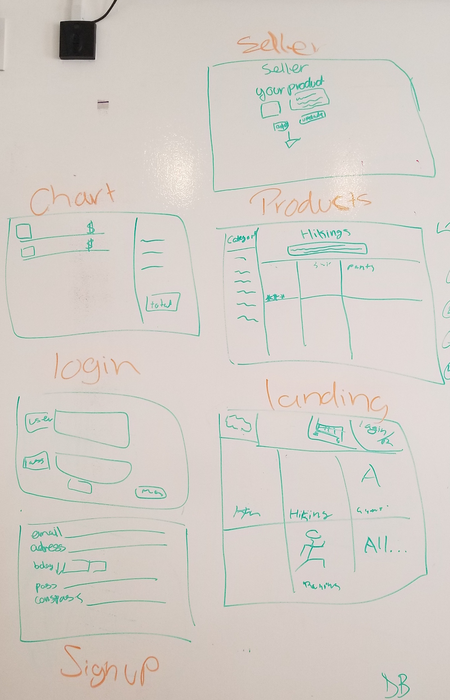

# Project Overview

## Project Description

<!-- Use this section to describe your final project and perhaps any links to relevant sites that help convey the concept and/or functionality. -->

The purpose of this app is for ...

- Site Example 1: https://www.amazon.com/
- Site Example 2: https://www.ebay.com/

## Wireframes

<!-- Include images of your wireframes.  -->



## Database Schema

### Table Name: users
| Column Name | Data Type |
| --- | :---: |
| id | primary key |
| username | text not null |
| email | text not null |
| password_digest | text not null |
| birthday |  |

### Table Name: products
| Column Name | Data Type |
| --- | :---: |
| id | primary key |
| user_id | references users(id) |
| name | text not null |
| description | text |
| price | integer not null |
| category_id | references categories(id) |
| image_url | text not null |
| amount | integer |

### Table Name: categories
| Column Name | Data Type |
| --- | :---: |
| id | primary key |
| category | ex) Hiking, Camping, Fishing, etc. |

### Table Name: payment_info 
| Column Name | Data Type |
| --- | :---: |
| id | primary key |
| card_no | integer not null |
| payment_type | ex) VISA, Mastercard, etc. |
| card_name | text not null |
| address_id | references shipping_address(id) |

### Table Name: shipping_address
| Column Name | Data Type |
| --- | :---: |
| id | primary key |
| address | text not null |
| zip_code | integer not null |
| state_id | references states(id) |

### Table Name: states
| Column Name | Data Type |
| --- | :---: |
| id | primary key |
| state | VARCHAR(2) |

### Table Name: cart
| Column Name | Data Type |
| --- | :---: |
| id | primary key |
| user_id | references users(id) |
| product_id | references product(id) |

## Priority Matrix

Include a full list of features that have been prioritized based on the `Time and Importance` Matrix. 

| Component | Priority | Estimated Time |
| --- | :---: |  :---: |
| Database Setup | 1 | 1hrs|
| Auth | 2 | 1hrs| 
| File Structure | 3 | 1hrs| 
| Page Layout | 4 | 6hrs| 
| Page Navigation | 5 | 4hrs| 
| Page Design | 6 | 9hrs|
| Total |  | 22hrs| 


## App Components

### Landing Page
<!-- What will a user see when they start your app? -->
A user will see...

### App Initialization
<!-- What will a user see when the app is started?  -->
When the app is started...

### Using The App
<!-- What will be the flow of the game, what will the user be expected to do and what will the user expect from the game. -->
User will...


## MVP 

<!-- Include the full list of features that will be part of your MVP  -->


## POST MVP

<!-- Include the full list of features that you are considering for POST MVP -->


## Functional Components

Based on the initial logic defined in the previous game phases section try and breakdown the logic further into functional components, and by that we mean functions.  Does your logic indicate that code could be encapsulated for the purpose of reusablility.  Once a function has been defined it can then be incorporated into a class as a method. 

Time frames are also key in the development cycle.  You have limited time to code all phases of the game.  Your estimates can then be used to evalute game possibilities based on time needed and the actual time you have before game must be submitted. 

| Component | Priority | Estimated Time | Time Invested | Actual Time |
| --- | :---: |  :---: | :---: | :---: |
| App Logic | 1 | 10hrs| 12hrs | 12hrs |
| Database Setup | 2 | 1hrs| 1hrs | 1hrs |
| Routes | 3 | 3hrs| 2hrs | 2hrs |
| Page Layout | 4 | 8hrs| 6hrs | 6hrs |
| Page Design | 5 | 9hrs| 12hrs | 12hrs |
| Post-MVP | 6 | 7hrs| 1hrs | 1hrs |
| Total |  | 38hrs| 34hrs | 34hrs |

## Helper Functions
Helper functions should be generic enought that they can be reused in other applications. Use this section to document all helper functions that fall into this category.

| Function | Description | 
| --- | :---: |
| toggleHide() | This will toggle the class 'hide' on or off element. The class hide has a display of none. | 

## Technologies Used

* OpenWeather API
* Google Geolocation API

## Code Snippet

Use this section to include a brief code snippet of functionality that you are proud of and a brief description. 

```

  function example(arg) {
    console.log('whatever');
  }

``` 
<!-- Brief description here -->

## Discoveries
 Use this section to list some, but not all, methods and\or functionality discovered while working on this project.

 * ex1
 * ex2

## Issues and Resolutions
 Use this section to list of all major issues encountered and their resolution.

 One issue I had was...
